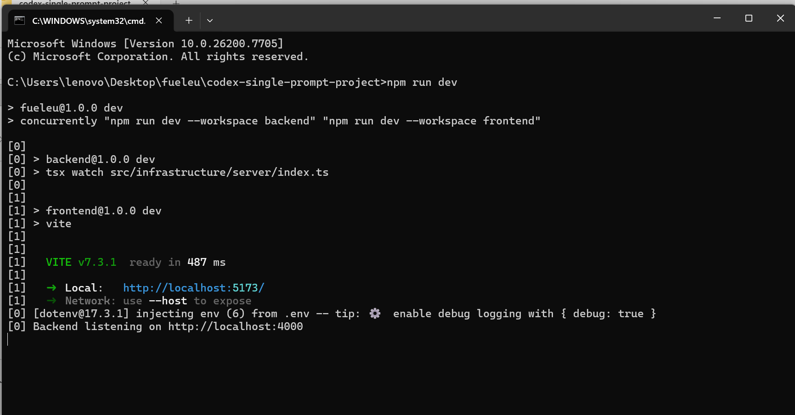
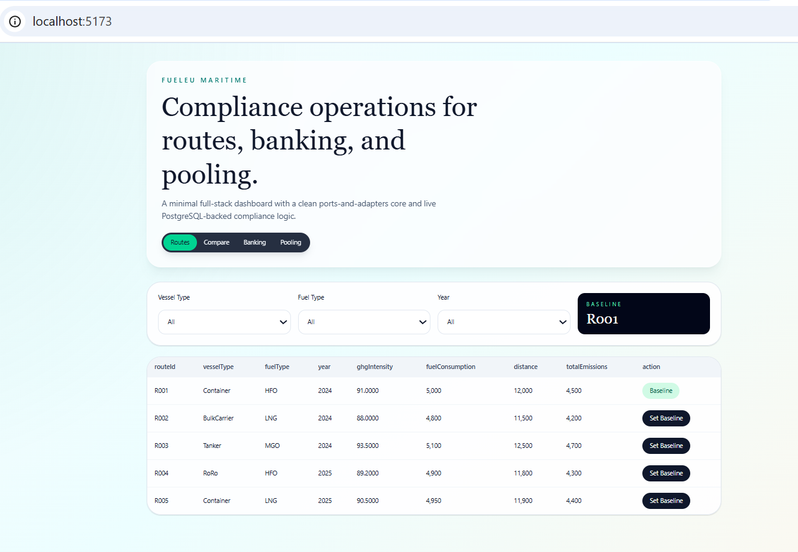
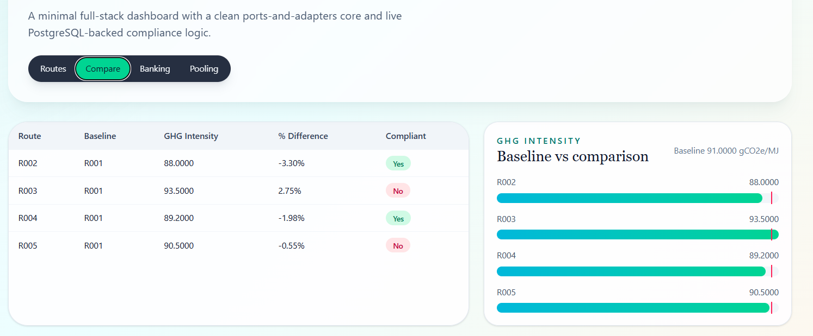
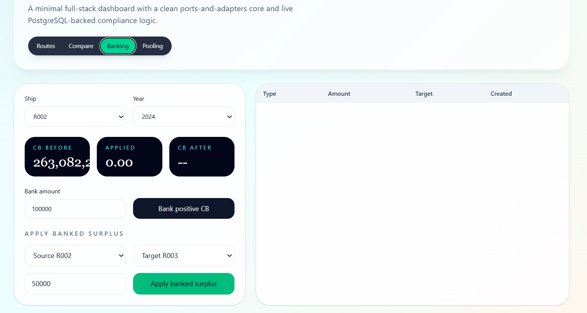
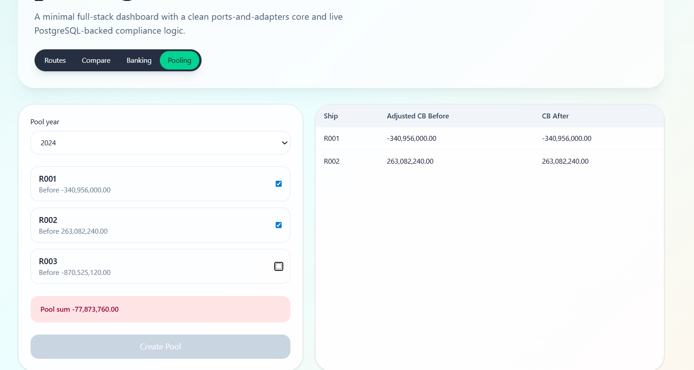

# ASSIGNMENT WORKFLOW SUMMARY
### NAME AND ROLLNO- jayapal v, 224bm1012

1- I read the assignment descripton provided in that mail link and created it as a file "assignment-description.txt".

2-Downloaded the reference pdf, it was big file, so i decided to get help from chatgpt.

## chatgpt- for understanding the project before coding.
3- Gave both files in chatgpt prompt. It mentioned that reference file was not needed. And it clearly explained about the project.

4- Understood the mathematical calculations/logics involved in this project. file- "docs/mathematical-calculations.md"

5- Understood about the hexagonal architecture and the folder structure and importance of ports and adapters.

6- Since I am working in my laptop(bought this week), I had to install all prerequisites again.

vs code, node, git, postgresql, etc.

 ## AI Agent(codex)- for autonomous code creation
 7- Its lazy approach, but due to time limit, i chose this option. I dont have claude code subscription that why chose codex. Actually my first plan was to complete the assignment in two methods:
 - complete autonomous creation using codex by using clearly described prompt(single prompt).

 - then to create again in separate folder, collaboratively with codex, copilot, chatgpt and manual.

 -then web host using azure students free subscription.

 but i cant complete the second method, cause I wasted lots of time in azure.

 8- For autonomus codex way, i first simply gave the assignment-description.txt to codex and it completed the project locally.

 9- Then i checked whether it included all backend logics or not, and then i created a well described prompt for single go execution, like "tasks.md" in cursor, as you mentioned in description.

 I have shared my codex well described prompt execution chat content in the file, "docs/CODEX_chat.md".

10- This time codex executed along with github push in fully autonomous way. Then ran it locally  by npm run dev, and also verified that the local database is wired perfectly.

I have shared some screen shots in docs/screenshots.

11- what i have learned from codex autonomous creation is that, it added some extra options also. and it lacks clear cut selection of routes in banking and pooling. so codex will be good for created template or iniatial working platform, then we have to refactor step by step using codex+chatgpt to shape the project to our requirements. Doing full manually, without ai and ai agents will be slow in creation but there the time of debugging will be less, since we know everything inside it. so using agents is like, first we built, then we learn, then we calibrate. 

12- currently working in collaborative ai-manual method and also in webhosting. I am not sure whether i can finish it or not before deadline 12pm 14/3/2026.

screenshots:

Have copied the folder to other github repo and deployed it in azure successfully.

link-https://fueleu-jay-ffe8dbfbc5hnaqgf.southeastasia-01.azurewebsites.net

github repo link- https://github.com/jayapal1012/webhostfueleu